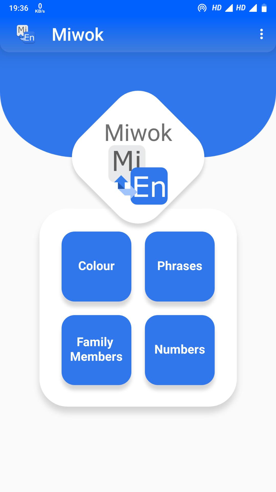
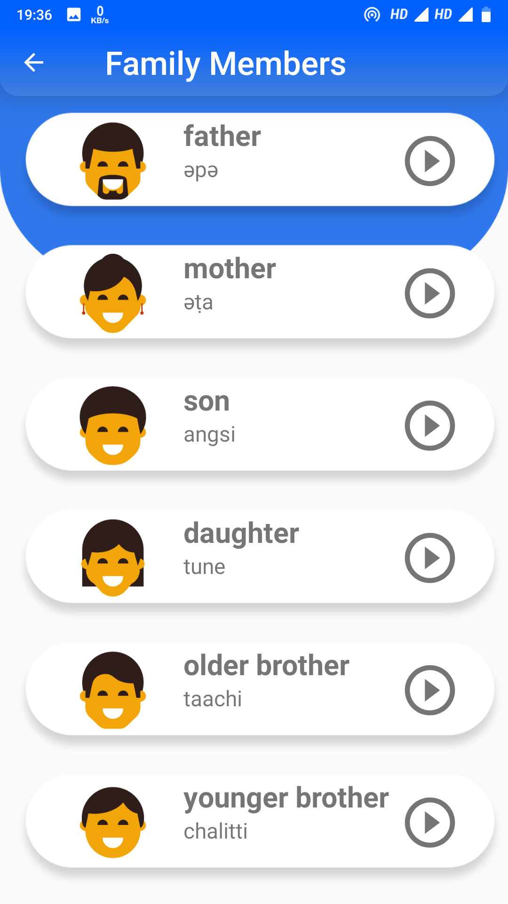
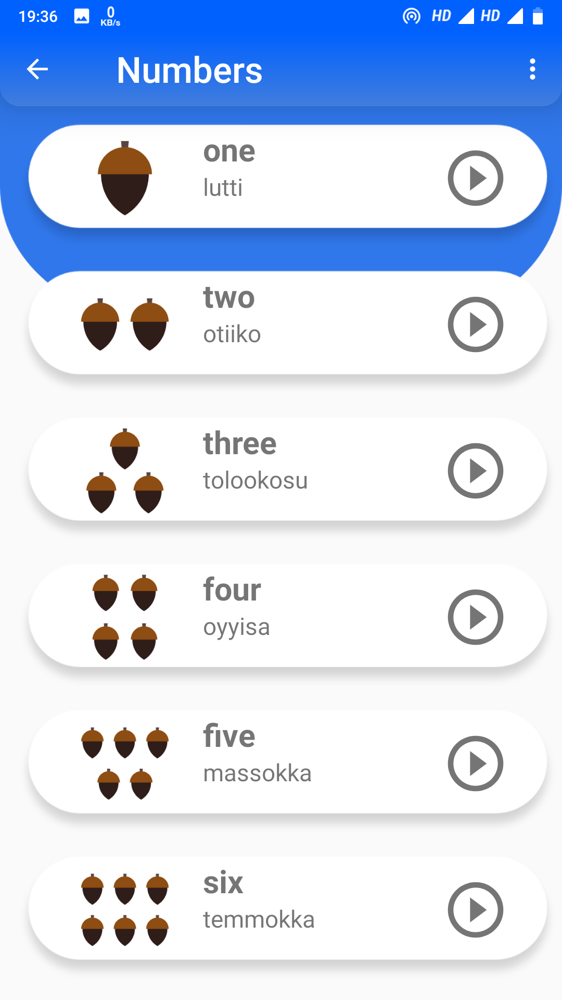
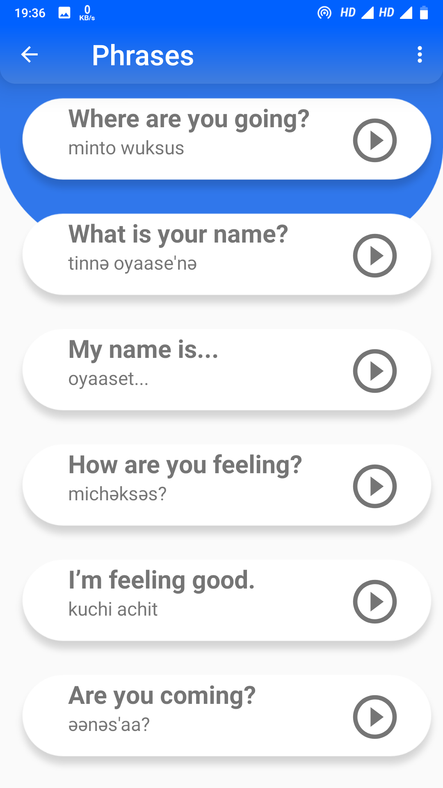

Miwok App  
===================================

This is a very simple app which provides easy Translation of English To Miwok along with audio and image support.
  
You can learn to pronounce some words, phrases, color names, family names which are used in Miwok Language.
  
<b>Components Used</b>: ListView, Custom ArrayAdapter, MediaPlayer classes.

Screenshots
------------
&nbsp;&nbsp;&nbsp;&nbsp; &nbsp;&nbsp;&nbsp;&nbsp;  
  
&nbsp;&nbsp;&nbsp;&nbsp; &nbsp;&nbsp;&nbsp;&nbsp;

Video
---------------
https://youtu.be/bs7vPhwRXoc

